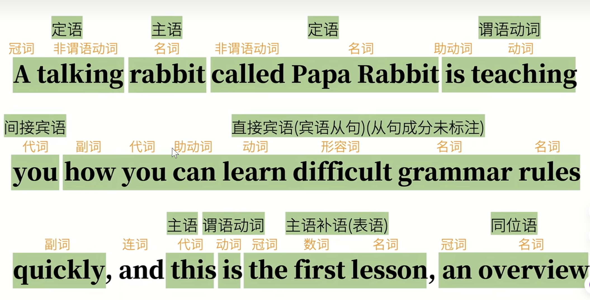
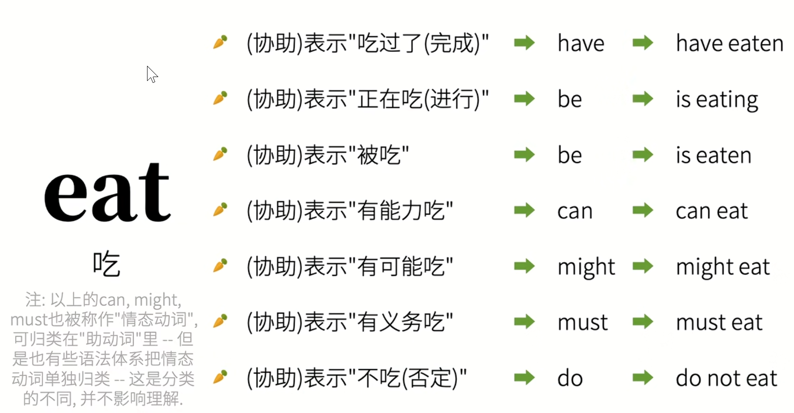
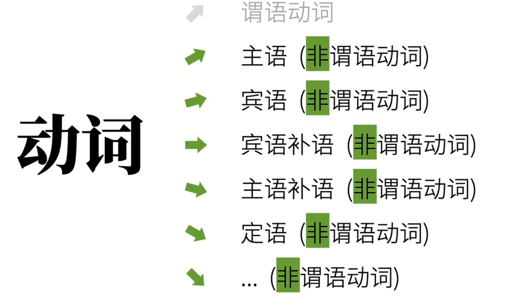
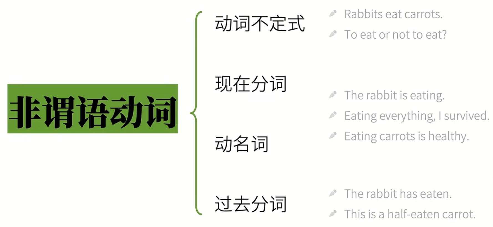
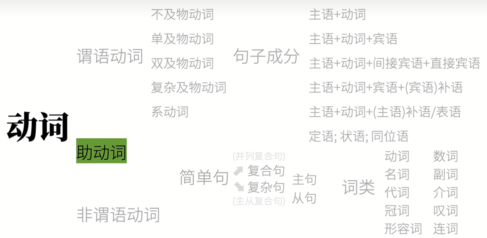

# 英语语法体系

语法的目的是为了造句。

简单句: 不能再拆的基本句。

简单句都是在说：什么怎么样。句子成分是主语+谓语。

```
什么 + 怎么样
主语 + 谓语
subject + predicate
```

主语：人或物
谓语：动作（动词），发生了什么事，谓语都有一个核心动词，叫谓语动词。
句子主语后余下部分就是谓语。谓语 >= 谓语动词。

有哪些动作（动词）
1. 可以独立完成的动作: 不及物动词(intransitive verbs, 没有承受者)。

Rabbit sleeps.
主语 不及物动词

2. 有1个动作的承受者：及物动词，动作承受者就是宾语。

Rabbit likes you.
主语 + 单及物动词 + 宾语

3. 有2个动作承受者。

```
Rabbit teaches you english.
主  双及物动词 间接宾语 直接宾语
```

4. 只有1个动作承受者（但需补充）

```
Rabbit consider you smart
主 复杂及物动词 宾语 (宾语)补语
```

5. 非动作，将后面的词(主语补语， 表语)赋予前面的词主语，即 <=，连系动词，系动词

```
Rabbit is tall 
Rabbit <= tall

Rabbit looks tall. // 看上去高, 被看

Rabbit smells nice.

主 系动词 补语
```

上面就是英语的五大句型。还有一种8大句型的分类，即在五大句型上增加：

6. there be 句型，即主 + 系动词 + 表语的倒装

```
There is a rabbit 
补语 系动词 主
```

7. 主 + 谓 + 状语，即`主 +  谓语动词`的延伸。

```
I live in China
```

8. 主 + 谓 + 宾 + 状，即第 4 种句型的延伸。

```
I put the carrot on the table
```

状语：主要是修饰动词、形容词、副词或整个句子。它能够在时间、地点、方式、程度、原因、目的、条件、让步等诸多方面对谓语动词等进行限制或描述。

补语：主要用于补充说明主语或宾语的状态、特征、身份、数量等情况。


句子成分：clause elements

1. 主语 Subject
2. 谓语动词 Predicate Verb
3. 宾语 Object
4. 宾语补语 Object Complement
5. 主语补语(表语) Subject Complement
6. 定语 Attribute: 用于修饰主语和宾语，起到限定和说明的作用

```
The little white rabbit ate a large carrot.

I found the movie which I watched tonight interesting.
```

7. 状语 Adverbial

```
The rabbit ate quickly.
```

8. 同位语 Appositve，用于再把主语或宾语说一遍

Rabbit, an English teacher, eats carrots.

> 插入语，如 This carrot, I think(插入语), is very tasty. 但是插入语是独立的，不作为句子成分

compound sentence 复合句(并列句)，句子的简单叠加。

complex sentence 复杂句，句子套在另一个句子里。从属关系。


一个句子套另一个句子：主句、从句(简单句)

名词性从句(4个)：
简单句作主语 -> 主语从句
简单句作宾语 -> 宾语从句
简单句作表语 -> 表语从句
简单句作同位语 -> 同位从句

作定语 -> 定语从句
作状语 -> 状语从句


同一类句子里有不同的词类

主    +    谓  +    宾
The rabbit ate   a carrot
He         saw   something over there.

词性(词类)
1. 名词 nouns
Papa Rabbit is a **rabbit**

2. 冠词 articles 冠词是一种虚词，用于名词之前，对名词起限定作用。a/an/the
Papa Rabbit is **a** rabbit

3. 代词 pronouns 代替主语或宾语
**I** am a rabbit

4. 形容词 adjective 修饰主语或宾语

I am a **small** rabbit

5. 数词 numerals
I ate **two** carrots

6. 副词 adverbs 修饰动作或形容词
I ate two carrots **quickly**.

7. 介词 prepositions 表示和其它词关系的词
I ate two carrots **with** chopsticks.


8. 叹词 interjections 表感叹
**Ah**, the carrot is tasty!

9. 连词 conjunctions 连接词和句
I ate two carrots and a potato, **because** I was hungry.


加上 动词，就是英语的 10 大词类。

句子成分        ≠    词类
clause Elements  Parts of Speech



其它句子成分可能是不同词类，但是谓语动词只能是动词。

谓语动词的三大本领
1. 动作**时**间 Tense
    - 现在
    - 过去
    - 将来
    - 过去将来
2. 动作状**态** Aspect
    - 一般
    - 完成
    - 进行
    - 完成进行

上面就是时态。

3. 动作假设、情感等， 表示动作的语气 Mood

虚拟语气 If I **were**(暗示并不是兔子) a rabbit...
陈述语气 I ate a carrot and...
祈使语气 Eat this carrot and...

谓语动词无法单独完成上面的本领，也无法完成表示否定，可能性，必须性等意思。需要加一些词帮助完成，这是助动词 auxiliary verbs。

吃  
eat 

吃过了(完成) have -> have eaten



助动词也可以做实义动词或其它词性。

can -> 易拉罐
might -> 力量
must -> musty -> 发霉的
do -> 做某事
have -> 拥有
be -> 存在

不要把它们做助动词的身份和它其它身份混淆。

非谓语动词： 动词还可以充当其它身份。



非谓语动词几乎可以取代所有的从句，从而简化句子。这不过这样的动词就不再具有表示动作时间、状态、语态、语气的功能。



